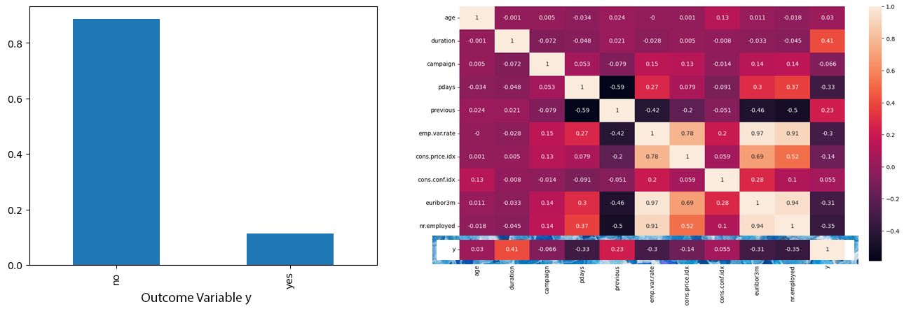
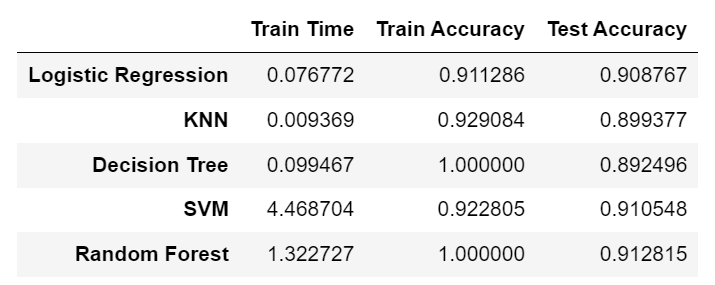
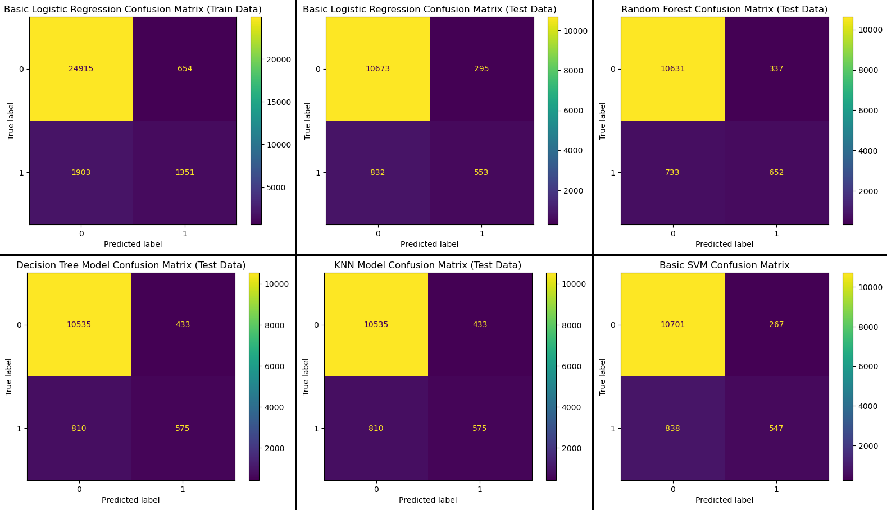
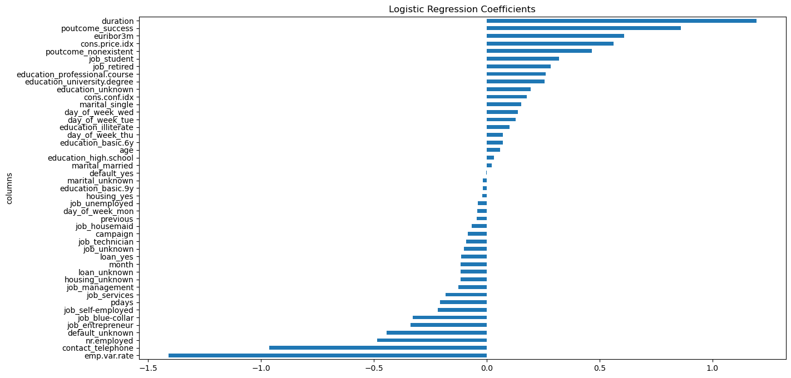
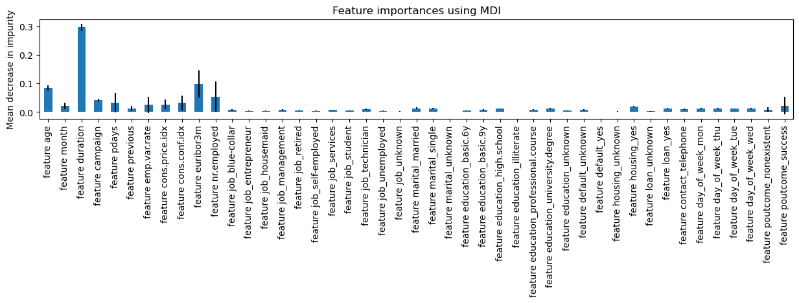
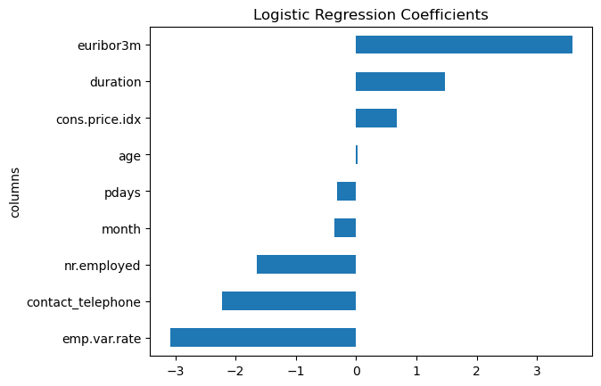
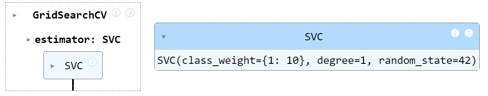
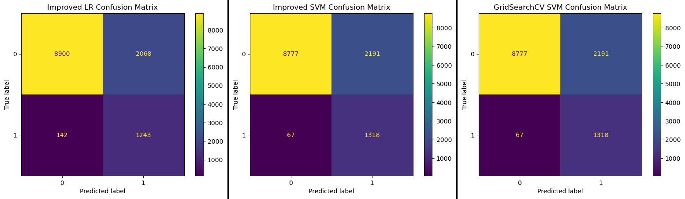
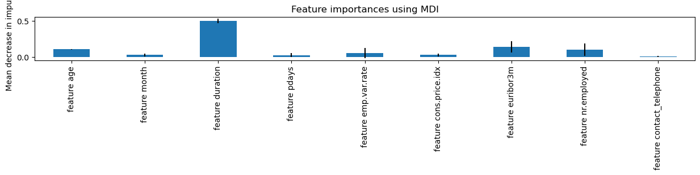
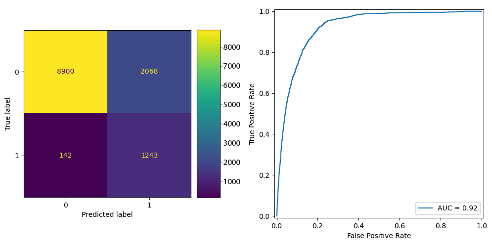

# ML Classification of Certified Deposit Bank Customers
The purpose of this project is to compare performance of different machine learning classifiers and build an efficient model to classify bank customers into prospects who would accept opening a CD and those who would not. With this model, the bank can predict the outcome of their marketing campaigns, and focus their resources on customers who are more likely to open a CD.

The data for this project comes from [UCI Machine Learning repository](https://archive.ics.uci.edu/dataset/222/bank+marketing) for a  Portuguese banking institution and is a collection of the results of multiple marketing campaigns. 

# Jupyter Notebooks
The accompanied [Jupyter Notebook](prompt_III.ipynb) provides the calculations, methodologies, and life-cycle of applying CRISP-DM process to this problem.

# Exploratory Data Analysis and Data Cleaning
The data from this dataset is very clean with no missing values and only 12 duplicates which were dropped accordingly. It has 41188 rows and 21 columns (11 numerical and 10 categorical). The outcome column is labeled "y" and contained "yes" and "no" values which were converted to 0s and 1s. Other categorical columns have been encoded with ***get_dummies()*** function.



Data have been split into train and test set by a 70/30 split. The data is highly imbalanced with 88.7% rejection and 11.3% acceptance. There is also scaling issue with the columns that was taken care of with ***StandardScaler*** class.

Performing a correlation heatmap reveals linear correlations between the outcome variable "y" that is positively depended on ***duration*** and ***previous***, and negatively is impacted by ***nr.employed***, ***pdays***, ***emp.var.rate***, ***euribor3m***, and ***cons.price.idx***.

# Baseline Model
A ***DummyClassifier*** returned 89% accuracy on train and test data, and it is the baseline for this imbalanced dataset. Any classifier has to do better than 89% which is a random classifier.

# Basic Models (first iteration)
Basic ***LogisticRegression*** model returns 91% accuracy on test and train data. 

Comparing it to basic non-hyperparameterized KNN, Decision Tree, SVM, and Random Forest model reveals the following result:


```
Accuracy of LR:  0.91
Precision of LR:  0.65
Recall of LR:  0.40
```
High accuracy is only one part of the story, and looking at the confusion matrix reveals that our basic models have low ***Recall*** scores. In this practical business—just like the classic malignant tumor cancer classification problem—our goal is to maximize marketing campaign efforts by signing up more customers for termed CD. If we have a low ***Recall*** score with high ***False Negative*** numbers, it means we are misclassifying some of the prospective customers as insignificant, and no matter how high our accuracy is, we are losing these businesses. So on the next iteration, ***GridSearchCV*** is used to find an optimal model to increase the ***Recall*** score.



## Feature Engineering
Basic ***Logistic Regression*** model revealed a good set of linear features that can be used to build the second iteration models. The pictures below show the raw features and their correlations:



Also, by looking at Random Forest Classifier, we can look for any non-linear correlation between features and outcome variable. Here, we see that "age" might have stronger correlation that is shown on the linear coefficients as shown below: 



## Improving Models (iteration two)

With linear and non-linear important features described in previous section, it was apparent that some of the features incomplete values, like "education_uknown" or "default_uknown" or "loan_unknown," have high correlations, so it was decided to drop these columns so we don't introduce unwanted noise to the data.

For the improved models, these columns are dropped from the dataset: job, marital, day_of_week, default, loan, cons.conf.idx, previous, poutcome, previous, education, campaign, and housing. An improved ***Logistic Regression*** model with the hyperparameters of ***(class_weight='balanced', penalty='l2', fit_intercept=False)*** revealed the following scores and coefficients with only 142 cases misclassified as ***False Negative***:
```
Accuracy of LR:  0.82
Precision of LR:  0.38
Recall of LR:  0.90
```


Here, we have doubled our ***Recall*** score, just by dropping irrelevant columns and adding support for imbalance classes. Improved SVM classifier with hyperparameters of ***(kernel='rbf', class_weight={1: 10})***, gives even better scores and only 67 cases of ***False Negative*** cases: 
```
Accuracy of SVM:  0.82
Precision of SVM:  0.38
Recall of SVM:  0.95
```
## Hyperparameters Tuning (iteration three)
Now that we know SVM returns the best results, using ***GridSearchCV*** we search for best kernel, degree, and class_weights:
```
param_dict = {  'kernel': ['linear', 'poly', 'rbf', 'sigmoid'],
                'class_weight': ['balanced', {1:2}, {1:5}, {1:10}],
                'degree': [1, 2, 3, 4, 5]  }
```

Cross validation search optimized for ***Recall*** score reveals the best SVM model with the following hyperparameters and scores:



```
Accuracy of GridSearchCV:  0.82
Precision of GridSearchCV:  0.38
Recall of GridSearchCV:  0.95
```

The scores of GridSearchCV are not any different than the scores of our improved SVM model. The confusion matrix for GridSearchCV is shown on the right-side of the improved models in below picture:



## Looking at Final Non-Linear Features
Using Random Forest classifier again, we can look into non-linear correlations of our reduced features dataset. Even with the ***calss_weight*** set to ***balanced***, training accuracy of 100%, and test accuracy of 91%, RF still returns a bad ***Recall*** score:
```
Accuracy of Improved RF:  0.91
Recall of Improved RF:  0.51
Precision of Improved RF:  0.62
```

The non-linear features relationship is nothing special here:


## ROC Curve and 80% Probability
Looking at the ***ROC Curve*** and 80% probability, we can reduce ***False Negative*** rate to 0.1% with 58% ***Accuracy***, if we are willing to spend 42% more marketing resources. Picture below shows Improved LR Model Confusion Matrix alongside the ROC Curve before applying the 80% probability:



## Conclusion
The question here remains for the Subject-Matter-Experts (SME) and business analysts: how many of the potential customers are we willing to sacrifice to release more marketing resources?

With our final SVM models, we have a ***False Positive*** rate of %17.7 and ***False Negative*** rate of only 0.5%. So we are using almost 20% more resources for marketing campaigns than ideal numbers. Although this can be costly from a business standpoint, a detailed cost-basis analysis is needed to see if it is worth sacrificing more resources or change the model parameters to allow lower ***Recall*** score.
